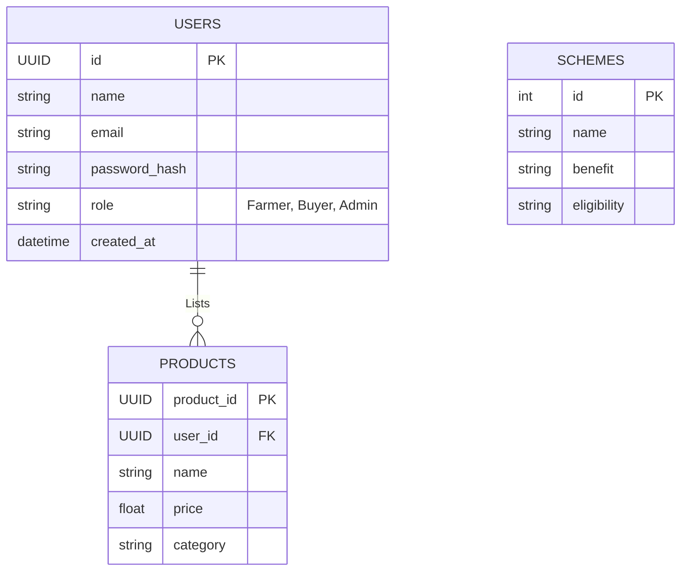

# Smart Farm Assistant - Official Documentation 📘

This directory provides the structural, relational, and functional documentation for the **Smart Farm Assistant** platform.

---

## 🏛️ 1. System Architecture Diagram

The system employs a tightly-coupled yet decoupled microservices model, enabling distinct CI/CD pipelines and independent horizontal scaling.

```mermaid
graph TD
    Client[Next.js Client UI (React)]
    Gateway[Node.js API Gateway (Express)]
    MLServices[Python ML Microservice (FastAPI)]
    
    DB_PG[(PostgreSQL - Primary DB)]
    DB_Mongo[(MongoDB - Chatbot/RAG DB)]
    DB_Redis[(Redis Cache & Session)]
    DB_ES[(Elasticsearch - News/Market)]
    
    Client -- REST/JWT --> Gateway
    Client -- WebSocket --> Gateway
    Gateway -- Sync/Async Data --> DB_PG
    Gateway -- Unstructured Queries --> DB_Mongo
    Gateway -- Pub/Sub & Caching --> DB_Redis
    Gateway -- Search Ops --> DB_ES
    
    Gateway -- REST -> MLServices
    MLServices -- Feature Retrieval --> DB_Redis
```

---

## 💾 2. Database ER Diagram
The system predominantly uses PostgreSQL as the source of truth for accounts.



---

## 🔌 3. API Documentation
Standard endpoints currently mapped:

### NodeJS Gateway Endpoints (`:5000`)
- **`POST /api/auth/login`**: Authenticates user and returns JWT token.
- **`POST /api/auth/register`**: Registers a new Farmer, Buyer, or Admin.
- **`GET /api/marketplace/products`**: Returns live products.
- **`GET /api/govt-schemes`**: Retrieves currently active government schemes.

### Python ML Endpoints (`:8000`)
- **`POST /api/crop/predict`**: Accepts soil payload (N, P, K, Temp, Humidity, pH, Rainfall) -> Returns `predicted_crop` & `confidence`.
- **`GET /api/rain/predict?location={city}`**: Checks external API and models local rain percentage.

---

## 🚀 4. Deployment Guide

### Prerequisites
- Docker Engine >= 20.x
- Docker Compose >= 2.x

### Single Command Cloud Deployment
```bash
# Deploys Next.js, Express Gateway, Python ML, Postgres, Mongo, Redis, Elasticsearch
docker-compose up -d --build
```
*Health Check*: Navigate to `http://localhost:3000` assuming port is open on the host IP. 

### CI/CD Info
- Ensure `.env` is securely injected via GitHub Secrets.
- Uses `docker-compose.yml` mapped to `--network farm_net`. Note that Next.js client uses `http://localhost:5000` context inside `fetch()` routines.

---

## 👨‍💼 5. Admin Manual
- Use `role: Admin` during DB Seeding.
- Navigate to `/dashboard/admin` *(currently gated)* to view Redis active sessions and view the PM-KISAN database logs.
- Wait for ElasticSearch indices to warm up before using the News Sentiment prediction features.
